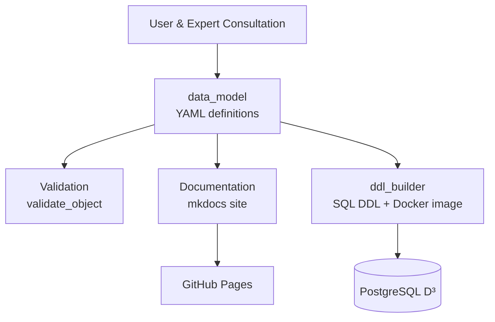

# DESIGN — DERC Dairy Database Data Model (D³)

> Planning and design document for the `data_model` repository.
> This document describes the goals of the project, the architecture as it
> exists today, the conventions that govern it, and the roadmap of work still
> to be done. Sections are marked **[Implemented]**, **[Partial]**, or
> **[Planned]** so the document doubles as a status board.

---

## 1. Purpose and Scope

The DERC Dairy Database (**D³**) is the canonical, human-readable data model for
the UBC Dairy Education and Research Centre (Agassiz, BC). It exists to:

- **Represent** the structure of the research database (databases, schemas,
  tables, columns, constraints, indexes) in a form that domain experts can read
  and review.
- **Document** every data element with rationale, so that changes are traceable
  and the model reflects accepted standards in the literature (e.g. the
  `instrument` entity follows Stocker et al. 2020 / PIDINST).
- **Generate** downstream artefacts from a single source of truth:
  human-readable documentation (this repo) and the executable SQL DDL
  (a separate `ddl_builder` package).

This repository owns the **model and its documentation only**. It deliberately
does *not* build or run the live database — that is the job of `ddl_builder`
and the deployment tooling. The contract between them is the validated YAML /
serialized model described in §4.

### Non-goals
- No data storage or ETL of actual research data.
- No database deployment, migrations, or DDL execution.
- No application/business logic beyond model definition and documentation.

---

## 2. Stakeholders and Governance

| Role | People | Responsibility |
|------|--------|----------------|
| Implementation | Simon Goring | Builds and maintains the model + tooling |
| Expert Review | M. von Keyserlingk, D. Weary, L. Guan, R. Cerri | Validate entities, fields, relationships |

Governance is intentionally lightweight and **version-control–driven**:
changes happen on branches, must compile with the provided tooling, and must
carry annotations explaining *why* the change supports ongoing research. The
goal is an inclusive process that balances user needs, expert knowledge, and
technical requirements.

> **[Planned]** A formal `CONTRIBUTING`/contribution guide expanding the branch
> workflow, review expectations, and release-note conventions.

---

## 3. System Context



- **This repo (`data_model`)** produces a validated, serialized model and a
  documentation site.
- **`ddl_builder`** (separate package) consumes the model and emits PostgreSQL
  DDL, packaged as a Docker image.
- Some database-level configuration (extensions, locale) is declared here and
  may also appear in the database Dockerfile maintained elsewhere.

---

## 4. Data Model Representation

### 4.1 Conventions
- Format follows the [`tbls`](https://github.com/k1Low/tbls) YAML convention,
  with an **added directory structure** so each entity lives in its own file.
- Hierarchy mirrors PostgreSQL: `database → schema → table → column`, plus
  `constraints` and `indexes` on tables.
- Files may **stand alone** or use a **`ref:` tag** to pull in another file or a
  whole directory, enabling reuse (e.g. shared audit columns `datecreated` /
  `datemodified`).

### 4.2 On-disk layout **[Implemented]**
```
data_definitions/
  dairymodel.yaml                 # database root: name, schemas (refs), extensions, locale, encoding
  schemas/
    dairy.yaml                    # schema: name, comment, tables (ref -> directory)
    apps.yaml
    dairytables/                  # one file per table
      cows.yaml
      datasets.yaml
      instruments.yaml
      ...
      columns/                    # reusable column fragments
        datecreated.yaml
        datemodified.yaml
        individualid.yaml
        ...
  users/
    users.yaml                    # role definitions (least-privilege model)
```

### 4.3 Entity shapes (validated keys)
Defined centrally in `validation.yaml`:

| Entity | Allowed keys |
|--------|--------------|
| database | `name`, `schema`, `owner`, `encoding`, `locale`, `extensions` |
| schema | `name`, `comment`, `tables` |
| table | `name`, `schema`, `type`, `comment`, `columns`, `constraints`, `indexes` |
| column | `name`, `type`, `comment` |
| constraint | `name`, `type`, `comment`, `definition`, `table`, `reference`, `columns` |
| index | `name`, `type`, `comment`, `definition`, `reference` |

`ref` is implicitly permitted on every entity.

> **[Risk / Planned]** Key-name drift exists between layers — `validation.yaml`
> and the data use `definition`/`indexes`/`reference`, while the documentation
> renderer reads `def`/`index`. These must be reconciled on one vocabulary
> (see §8).

---

## 5. Software Architecture

The Python package `data_model` (in `src/data_model/`, `src`-layout) is a thin
**load → validate → render** pipeline.

```
load_database ─▶ load_schema ─▶ load_tables ─▶ load_columns
      │               │              │              │
      └──────────────-┴──────────────┴──────────────┘
                     validate_object  (against validation.yaml)
                          │
                     document_database ─▶ Markdown pages (createDocs)
```

| Module | Responsibility | Status |
|--------|----------------|--------|
| `load_files.py` | Read a YAML file → dict, or a directory → list of dicts | [Implemented] |
| `validate.py` | `validate_object`: resolve `ref`, reject unknown keys | [Partial] |
| `load_database.py` | Load DB root, resolve schema refs | [Implemented] |
| `load_schema.py` | Load schema, resolve table-directory refs, flatten | [Implemented] |
| `load_tables.py` | Load tables, resolve per-column refs | [Implemented] |
| `load_columns.py` | Load + validate a column fragment | [Implemented] |
| `createDocs.py` | Render database/schema/table Markdown pages | [Implemented] |
| `__init__.py` | Public API surface | [Implemented] |
| `main.py` (root) | Orchestration: load → document → dump `output.yaml` | [Implemented] |

### 5.1 Public API
Exported from `data_model`: `load_file`, `load_database`, `load_schema`,
`load_tables`, `validate_object`, `document_database`.

### 5.2 Validation strategy **[Partial]**
Currently `validate_object` only checks for *extra* (unknown) keys and merges
`ref` targets. It does **not** verify required fields or value types (e.g. that
`column.type` is a valid PostgreSQL type). See §8 for the intended hardening.

### 5.3 Documentation rendering **[Implemented]**
`createDocs.py` walks the loaded model and writes a Markdown tree under
`docs/database/` (`index.md` → per-schema → per-table pages with Columns,
Constraints, Indexes, Relationships sections). Tables are rendered with
`py-markdown-table`. Output is deterministic (explicit column ordering).

> **[Known issue]** `document_database` ignores its `path` argument and always
> writes to `./docs`; the Relationships section is a placeholder.

---

## 6. Documentation Site

- **Generator:** MkDocs + Material theme (`mkdocs.yml`), with `mermaid2`,
  `include_dir_to_nav`, `search`, and `minify` plugins.
- **Authored pages [Implemented]:** Introduction (`index.md`), Governance
  (`admin/governance.md`), Executive Summary (`summary/executive_summary.md`).
- **Generated pages [Implemented]:** `docs/database/**` produced by `createDocs`.
- **Hosting:** GitHub Pages at `https://ubc-derc.github.io/data_model/`.

> **[Planned]** `resources.md` (Resources & Concepts) is linked from the index
> but not yet written.

---

## 7. Build, CI/CD, and Tooling

| Concern | Tooling | Status |
|---------|---------|--------|
| Packaging / env | `uv` + `uv_build` (`pyproject.toml`), Python ≥ 3.12 | [Implemented] |
| Project scaffolding | Copier (`.copier-answers.yml`, `derc_copier` template) | [Implemented] |
| Lint | Ruff (`.ruff_cache` present) | [Partial] |
| Tests | Pytest (`tests/`, `pythonpath=src`) | [Partial] |
| Docs deploy | GitHub Actions → `mkdocs gh-deploy` on push to `main` | [Implemented] |

> **[Cleanup]** Two workflows (`ci.yml` and `annoying.yml`) are duplicates that
> both run `mkdocs gh-deploy`. One should be removed, and a **test/lint CI job**
> added (currently nothing runs the test suite in CI).

---

## 8. Testing Strategy

**[Partial]** A test suite exists under `tests/` covering the foundational
pieces:

- `test_load_files.py` — file/dir dispatch, error handling, and documented
  edge cases (only first list element returned; `.yml` files skipped by glob).
- `test_validate.py` — clean pass-through, unknown-key rejection, `ref` merge,
  and the missing-required-key gap.
- `test_create_docs.py` — table/section renderers and page writers, plus the
  hardcoded-output-path behaviour.

**[Planned]** Next tiers:
1. End-to-end integration test over the real `data_definitions/` tree (every
   `ref` resolved; counts match files on disk; round-trips through YAML).
2. Schema/contract test asserting each definition file's keys are a subset of
   `validation.yaml`, *and* that the renderer reads the same key names — this
   would catch the `def`/`definition` and `index`/`indexes` drift.
3. Snapshot tests for generated Markdown.

---

## 9. Known Issues & Technical Debt

| # | Issue | Impact | Area |
|---|-------|--------|------|
| 1 | `def` vs `definition`, `index` vs `indexes` key drift | Constraint defs & all indexes silently omitted from docs | §4.3 / createDocs |
| 2 | `load_file` globs `*.yaml` only | `datasetidentifiers.yml` never loaded | load_files |
| 3 | `load_file` returns only `safe_load(...)[0]` | Multi-document files truncated | load_files |
| 4 | `validate_object` checks only extra keys | Missing/invalid fields pass silently | validate |
| 5 | `document_database` ignores `path` arg; needs pre-existing `docs/` | Inflexible, fragile | createDocs |
| 6 | Duplicate CI workflows; no test CI | Wasted runs, no automated test gate | CI |
| 7 | Relationships section is a placeholder | Incomplete docs | createDocs |

---

## 10. Roadmap

**Milestone A — Correctness & contracts**
- Unify field vocabulary across `validation.yaml`, data files, and `createDocs`.
- Fix `.yml`/multi-doc loading; add required-field + type validation.
- Add the contract + integration tests (§8).

**Milestone B — Completeness**
- Render table Relationships from constraints/references.
- Author `resources.md`; finish executive/summary pages.
- Define the `users` (role/privilege) model and document it.

**Milestone C — Process & delivery**
- Single CI workflow: lint + test on PRs, docs deploy on `main`.
- Write the contribution guide and release-note conventions.
- Formalize the `data_model` → `ddl_builder` interface (versioned `output.yaml`).

---

## 11. Glossary

- **D³ / dairymodel** — the DERC Dairy Database model defined in this repo.
- **DDL** — Data Definition Language; the SQL that creates the database.
- **`ref`** — YAML tag pointing to another file/directory for reuse.
- **`ddl_builder`** — separate package that turns this model into SQL DDL.
- **tbls** — the documentation/format convention this model is modelled on.
