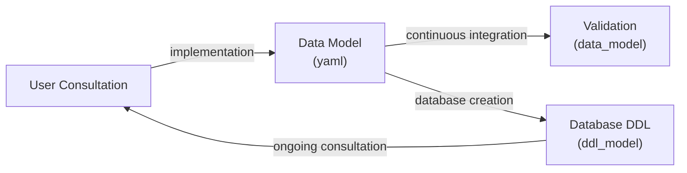

[](https://github.com/UBC-DERC/data_model/actions/workflows/ci.yml) [](https://github.com/UBC-DERC/data_model/actions/workflows/codeql.yml)

[]()

[](LICENSE.md)

# Human Readable Data Models for Database Design

This project generates a valid YAML file to help manage the development and evolution of SQL data models. It supports the creation of a Postgres database with extensions, schemas, tables, columns, indexes and constraints. A user will create a set of YAML files representing the database, organized within folders, and the script will validate these files and generate linked markdown documentation for the user. The documentation is structured such that it can be easily placed into an existing `mkdocs` project.

This repository contains an example `yaml` data representation in the `examples` folder, based on early prototyping of the data model for the [UBC Dairy Education and Research Center](https://dairycentre.landfood.ubc.ca/).  The `yaml` formatting follows the example used by [`tabls`](https://github.com/k1Low/tbls) elsewhere, with an added directory structuring to make individual tables easier to process, modify, validate and document. Structurally we aim to borrow aspects of `tabls` and the [OpenAPI project](https://www.openapis.org/). Both of which heavily influenced our thinking and design philosophies.

## Optimal Design Flow



Design should always begin with user consultation. This consultative process can help develop ideas for which tables, columns or relationships are critical for the data model. Data model development is iterative, and so we developed this tool to support the process through the generation of "live" documentation that can run from plain text files and render to web-readable outputs that can be examined by all interested parties.

## Installing this Package

To install from this GitHub repository, either install using a graphical tool such as GitKraken or GitHub Desktop, or install from the console using:

```bash
git clone https://github.com/UBC-DERC/data_model.git
cd data_model
uv sync
```

This assumes you have the [`uv`](https://docs.astral.sh/uv/getting-started/installation/) package manager installed.

## How to Use this Repository

Once installed, the `data-model` command validates a model and writes both the
composite YAML artifact and the MkDocs documentation:

```bash
uv run data-model <path/to/entry.yaml> --docs <docs-output-dir> --output <composite.yaml>
```

For the example model bundled in this repository:

```bash
data-model examples/data_definitions/dairymodel.yaml --docs docs --output output.yaml
```

The `examples/data_definitions/` folder is **example input** — point the tool at the
entry file of any directory of definitions.

Validation runs in two phases:

1. structural checks on each definition (unknown keys, malformed constraints)
2. cross-reference checks across the assembled model (every referenced table and
column must exist). 

If either phase fails, the command prints **all** problems at once to stderr, writes **no** output, and exits with a non-zero status —
suitable for gating a deployment pipeline before DDL generation.

The composite `--output` YAML is the fully-resolved model (all `ref:` targets merged, reference schemas/tables filled in) intended for the downstream DDL generation stage.

## Editing/Modifying or Working with the Data Model

The YAML file(s) used to define the database can be structured so that they are all in one file (see: [output.yaml](examples/output.yaml)), or, you can make use of the `ref` tag to refer to other files (see: [data_definitions](examples/data_definitions/dairymodel.yaml)). In this way, managing a complex data model with repeated elements can be simplified, by defining a field only once, and all documentation will be updated with any change.

This conceptual model borrows from the [OpenAPI `$ref` implementation](https://swagger.io/docs/specification/v3_0/using-ref/).

### File and Folder Structure

Within this repository we will create a named folder, here [`data_definitions`](examples/data_definitions). Within the folder are all the `yaml` files that make up the data model. These files contain the critical information for database, schema, table and column definitions. We create these files to support the work of experts in defining the critical fields and concepts used in the database.

The database itself is defined by a folder structure, modeled after PostgreSQL database structure: `database` -> `schema` -> `table` -> `column` although this folder structure is not enforced. Each folder contains individually named files for each of the elements within that hierarchy. Individual files can stand alone, or we can use the `ref` tag to point to other files.

## Examples

### Simple Database and Documentation

In `examples/simple_example` we define a database file as [`database.yaml`](examples/simple_example/database.yaml) with the text:

```yaml
- name: dairymodel
  schemas:
    - name: dairy
      comment: |
        The main dairy schema, with all data structures used for the farm.
    - name: apps
      comment: |
        The schema used for application specific tables, views and materialized views.
```

If we run:

```bash
data-model examples/simple_example/database.yaml --docs docs --output examples/simple_example/output.yaml
```

We will expect to see that we have a file called [`output.yaml`](examples/simple_example/output.yaml), and a directory in `docs/database` that contains an `index.md` file and two folders, one for each named schema.


### Database with References

We can use references to sub-folders with the `ref` tag, to point to folder content for more complex examples, as in our example within [`examples/data_definitions`](examples/data_definitions/)

```yaml
- name: dairymodel
  schemas:
    - ref: schemas/dairy.yaml
```

Using the `ref` tag also allows us to re-use certain content, for example, columns for understanding data creation dates and data modification dated.

The `dairymodel.yaml` file defines elements of a preliminary design for a dairy farm database. This includes pointers to particular database extensions, schema definitions, and other elements that are required to define a database.

We can see a database structure with nested schema and `tables`. Individual files defining `tables` contains definitions of each of the tables, following a `yaml` model:

```yaml
- name: tablename
  type: one of [BASE TABLE, VIEW, MATERIALIZED VIEW]
  schema: one of the schemas defined in the `dairymodel.yaml`
  columns:
  - name: columnname
    type: a valid postgres data type (https://www.postgresql.org/docs/current/datatype.html)
    comment: a text comment (may include html or markdown)
  constraints:
  - name: constraintname
    comment: |
        Some example primary key.
    type: one of [PRIMARY KEY, REFERENCES, UNIQUE, CHECK]
    ddl: PRIMARY KEY (columnname, columnname)   # authoritative SQL for this constraint
    columns:                                     # the constraint's OWN (local) columns
    - columnname
    - columnname
  - name: a_foreign_key
    comment: |
        A foreign key also names the table it points at.
    type: REFERENCES
    ddl: FOREIGN KEY (localcolumn) REFERENCES othertable (targetcolumn) ON UPDATE CASCADE
    columns:                                     # local column(s) the FK is defined on
    - localcolumn
    references:                                  # only REFERENCES may carry a `references`
      schema: dairy                              # optional; defaults to the owning table's schema
      table: othertable                          # optional; defaults to the owning table (self-FK)
      columns:                                   # the REFERENCED column(s) in the target table
      - targetcolumn
  indexes:
  - name: indexname
    type: A valid postgres index type.
    ddl: CREATE INDEX indexname ON tablename (columnname)
    columns:                                     # indexes carry only local columns
    - columnname
```

## Validation

The structured fields exist to help non-SQL users and to let the
tool validate references: a constraint's `columns` must exist in its own table,
and a `references` block (allowed only on `REFERENCES`) must point at an
existing `(schema, table)` whose `columns` exist. When `schema`/`table` are
omitted from a `references` block they default to the owning table.

From these sets of yaml files we can build both documentation using `mkdocs` (in this repository) and we can build the actual SQL DDL for the database (using the [`ddl_builder`](https://github.com/UBC-DERC/ddl_builder) package). This structure allows us to clearly document the development of any database and all its various components.

## Contribution

This project was developed by:

* [](https://orcid.org/0000-0002-2700-4605): Simon Goring

Contributions to this repository are expected to follow the [Code of Conduct](CODE_OF_CONDUCT.md).

## Funding Statement

This project was developed with funding from [Farm Credit Canada](https://www.fcc-fac.ca/).
