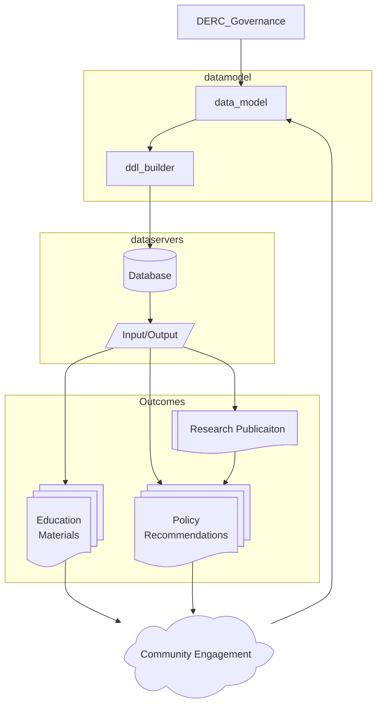

# Executive Summary

The Data Platform for DERC will leverage past research contributions and power future growth of the Dairy Education and Research Centre, and drive innovation in the dairy sciences. The digitization of dairy herd management leads to new opportunities for research at DERC to be disseminated to dairy farmers, and provides pathways to engage British Columbia and Canadian dairy farmers to directly engage in research.

The Data Platform will serve multiple communities:

* DERC Managers and Administrators
* Researchers
* Dairy Farmers
* Industry Partners
* Funding Agencies
* General Public

## Key Outcomes

The goal of this project is to **establish a data resource to store and manage dairy information** about dairy operations at DERC. This goal is paired with the **development of a toolset to return data** in ways that are useful to different user groups, including researchers, the public and policymakers.

While a data professional may be able to develop this platform, the platform must also **establish community trust**. To do this, it requires some form of [governance](../admin/governance.md), documentation and guidance.

## Data Value and Governance

DERC produces data about cows, milk production, rumen microbiomes, methane production, vetrinarian treatments, and temperature, as well as research protocols, personel, education programs and other elements.

DERC will use this data to produce a high quality curated data resource. Curation requires governance of the data model, vocabularies, and quality assurance.  To facilitate curation and governance we are developing an open data platform to collect and distribute the data.

### Project Success Metrics

The following are tangible goals to be identified as components of project success:

1. **[This Repository](https://github.com/UBC_DERC/data_model)** Data Model Development: The data model will be written in "plain text" YAML, with clear field comments, to be applied to a Postgres database. The data fields will:
   1. Have clear contribution guidelines, to support expert engagement
   2. Be clearly commented
   3. Be linked to established concepts in animal science/dairy sciences or external concepts and standards (such as FOAF, schema.org or DarwinCore)
   4. Identify data constraints and assertions about the data that can be used to detect data issues
   5. Be open and available for comment
2. **[DDL Builder](https://github.com/UBC_DERC/ddl_builder)** Database Construction: The data model must be able to be integrated into a functioning (PostgreSQL) database. This component will:
   1. Be clearly documented
   2. Produce the database itself in a reproducible manner across platforms (Cloud, Mac, Windows, Linux, etc.)
   3. Be faithful to the data model
3. **[Data Retrieval](https://github.com/UBC-DERC/data_population)** Database Population: The initial entries into the database, particularly from external sources (journals, data resources, drug manufacturers) should use the input/output processes that will be used for other services. The Data Retrieval process should be able to create these input/output pathways and use them successfully. The system should:
   1. Provide public documentation for data access
   2. Support authentication for sensitive data
   3. Support data insertion, updates, deletions and data access
   4. Include clear documentation for common research data queries based on existing DERC research
   5. Import data from existing DERC assets
